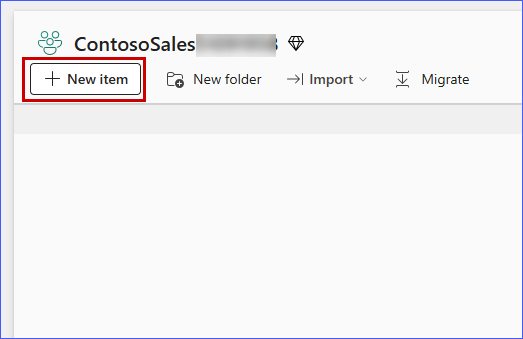

### Exercise 1: Data Engineering and Data Factory experience: Data ingestion from a spectrum of analytical data sources into OneLake

*Before we start executing the steps, we will open a backup Click-by-Click lab using the following hyperlink in a new tab and navigate back to the VM browser:* [Click-by-Click](https://regale.cloud/microsoft/play/3781/modern-analytics-with-microsoft-fabrikam-copilot-and-azure-databricks-dream-lab-#/0/0)

### Task 1.1: Create a Microsoft Fabric enabled workspace

In this exercise, you will act as the Data Engineer, Eva, to transfer Contoso's data from Azure SQL Database into the Lakehouse and initiate data preparation for the upcoming merger between Contoso and Litware Inc.

1. Open **Microsoft Fabric** in a new tab by copy pasting the below link.

   ```BASH
   https://app.fabric.microsoft.com/home
   ```

2. Sign in with your Azure AD credentials. If you are not already signed in, you will be redirected to the Microsoft Fabric login page.

   >**Note:** Close any pop-up that appears on the screen.

    .png)

3. From the left navigation pane, click on **Workspaces** and then the **+ New workspace** button.

	

4. Type the name **<inject key= "WorkspaceName" enableCopy="true"/>**, **validate** the availability of the name, and click on **Advanced**.

   >**Note:** Only use the workspace name provided above.

   >**NOTE:** If the name **<inject key= "WorkspaceName" enableCopy="false"/>** is already taken, refresh the page and check again. A workspace with that name may already be created. If so, add a different suffix until the name is available.

    

5. Ensure **Fabric capacity** is enabled, verify that **fabric...- North Central US** is selected under **Capacity**, and then click **Apply**.

    

   >**Note:** Close any pop-up that appears on the screen.

   

   

   >**Note:** Wait for the Power BI Workspace to load.


# Create/Build a Lakehouse

Now, let's see how each department can easily create a Lakehouse in the Contoso workspace without any provision. They simply provide a name, given the proper access rights of course!

1. Click on the **New item**.

    

2. In the new item window, search for the **Lakehouse** and click **Lakehouse**.

    

    >**Note:** Screenshots in the exercises may sometimes differ from the actual lab. Please adjust your screen resolution to locate items and select them as needed.

3. Copy the name **lakehouse** from the following and paste it in the **Name** field.
    ```
    lakehouse
    ```
4. Click on the **Lakehouse schemas** checkbox and then click on the **Create** button.

    

In just a few seconds, Lakehouse was created by simply providing a name and no resource provisioning was needed. With the right access, you, as a Data Engineer, can effortlessly create a new Lakehouse. There is no need to set up any storage accounts or worry about network, infrastructure, key vault, Azure subscriptions, etc.

---

### Task 1.2: Use the New Shortcut option from external data sources

Now, this is something exciting! This section shows how easy it is to create Shortcuts without moving data. That is the power of OneLake! In this exercise, you will ingest the curated bounce rate data for Litware from ADLS Gen2 using the New Shortcut option. Let's see how!

1. Click on the **three dots (ellipses)** on the right side of Files.

2. Click on **New shortcut**.

    >**Note:** Make sure you create a shortcut under **Files** and not under **tables** in the lakehouse explorer pane.

    

3. In the pop-up window, under **External sources**, select the **Azure Data Lake Storage Gen2** source.

    

    >**Note:** Wait for the screen to load.

4. Select **Create new connection**
5. In the screen below, we need to enter the connection details for the **ADLS Gen2** shortcut.

    

6. In the **URL** field type the endpoint: **<inject key= "storageEndpoint" enableCopy="true"/>**

7. Select **Organization account** in the **Authentication Kind**, and ensure you are signed in and click on **Next**.

    

8.  Select the **data**, **litwaredata** and **Products** checkbox and then click on the **Next** button.

    

9. Click on the **Create** button.

    

10. And there you go! Your shortcut is now ready! Click (do not expand) on the newly created shortcut named **litwaredata**.

    

Prior to Microsoft Fabric, departments in Contoso had to move the data they needed from other departments via time-consuming ETL processes. But look, now they have created shortcuts. No need to move any of this data. That is the power of OneLake!

---

### Task 1.3: Create Delta tables using Spark Notebook

Now, let's see how Data Engineer, Eva, got the remaining data into OneLake by creating Delta tables using Spark Notebook. By using a Spark Notebook to create Delta tables, Eva can ensure more reliable, scalable, and efficient data management, which is essential for handling big data workflows.

1. Click on **<inject key="WorkspaceName" enableCopy="false"/>** workspace from the left navigation pane and select **New item**.

    

2. In the **New Item** tab, search for the **Notebook** and select **Notebook**.

    

    >**Note:**  If the **Pop-up** appears click on **Skip tour**

    

3. Click on the **Add data items** dropdown and then select **Existing data sources**.

    

4. Select the **lakehouse** and then click on **Connect**

    

5. Once the notebook is created, paste the **below code** in the existing cell and run the cell by clicking on the **Run cell** icon.

    ```
    # Spark path to the folder in Lakehouse
    file_path = 'Files/litwaredata/'

    # Read all CSV files in the folder
    df = spark.read.option("header", "true").csv(f"{file_path}*.csv")

    csv_files = ["CustomerChurnData.csv", "dimcustomer.csv", "dimdate.csv", "dimproduct.csv", "dimreseller.csv", "factinternetsales.csv", "factresellersales.csv", "website_bounce_rate.csv"]  # Replace with your actual file names

    for file in csv_files:
        table_name = file.split('.')[0]
        path = f"Files/litwaredata/{file}"
        df = spark.read.option("header", "true").csv(path)
        df.write.mode("overwrite").format("delta").saveAsTable(table_name)
    ```
    >**Note:** Skip running the code below if the previous query executed successfully.

    ```
    import os
    import pandas as pd
 
    # List all CSV files in the 'litwaredata' folder
    file_path = '/lakehouse/default/Files/litwaredata/'
    csv_files = [file for file in os.listdir(file_path) if file.endswith('.csv')]
 
    # Load each CSV file into a table
    for file in csv_files:
        table_name = file.split('.')[0]
        df = pd.read_csv(file_path + file)
        spark.createDataFrame(df).write.mode("ignore").format("delta").saveAsTable(table_name)
    ```

    

6. Once the execution is successful, you'll see a **green tick** at bottom of the cell. Now, click on **Stop** icon in the ribbon at the top to **stop the Spark session**, then click on **Lakehouse**.

    

7. Expand **tables**, expand **dbo**, click on the **three dots**, and then click on **Refresh**. 

    

8. View the successfully **loaded tables**.

    

9. Click on **website_bounce_rate** delta table and view the website bounce rate data.

    

10. You now have all the tables in **OneLake** for Contoso to leverage.

