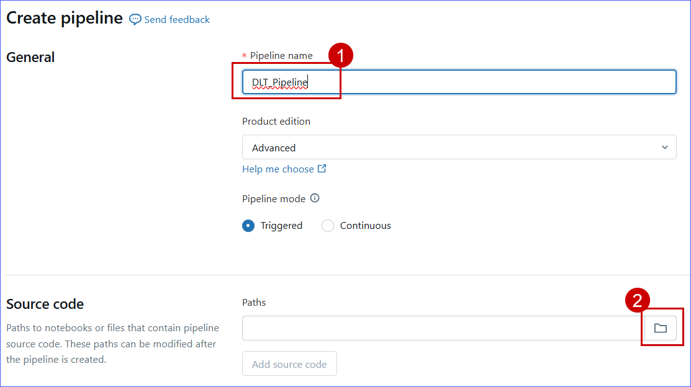

### Exercise 2: Azure Databricks integration with Fabric: DLT Pipelines, Unity Catalog (Data governance), Mirrored Azure Databricks Catalog
This exercise shows how Microsoft Fabric with Databricks enabled Contoso to solve their integration challenges. The acquired company, Litware Inc., was already using Databricks heavily and they stored their churn and sales data in ADLS Gen2. We'll see how Unity Catalog benefited Contoso's data architects so they could quickly get up to speed on all Litware Inc.'s data.

### Task 2.1: Create Delta Live Table pipeline for Data Transformation

Delta Live Tables (DLT) allow you to build and manage reliable data pipelines that deliver high-quality data in Lakehouse. DLT helps data engineering teams simplify ETL development and management with declarative pipeline development, automatic data testing, and deep visibility for monitoring and recovery.

1. Open a new tab in your VM browser and sign in to the Azure Databricks Workspace, by clicking on
+++https://@lab.Variable(workspaceurl)+++ and press **ENTER**.

2. Click on the **Sign in with Microsoft Entra ID**.


3. Scroll down in the left navigation pane and click on **Pipelines**.


4. Click on the **Create** dropdown and select **ETL pipeline**.


5. Enter the name of the pipeline as +++DLT_Pipeline+++ , scroll down to the **Paths** and click on the file icon to browse the notebook.



6. Click on **Shared**.

7. Click on **Analytics with ADB**.

8. Click on the **01 DLT Notebook**.

9. Click on the **Select** button.


10. In the **Default schema** field, type +++dbo+++ and click on the **Create** button.


<!-- 
>**Note**: Do not click on the **Start** button. Due to time constraints, We will not be executing this pipeline. -->

11. Click on the  **Start** button.


>**Note**: The pipeline will take 5-7 minutes to complete. In the meantime, you can move on to the next section and return to this one afterward.

12. Once the execution is completed, we will see a result similar to the one in the following screenshot.


This beautiful lineage view showing the Medallion Architecture is a data design pattern commonly used in Databricks to organize and optimize data processing workflows in a lakehouse architecture. It structures data into three logical layers-Bronze, Silver, and Gold-ensuring data quality, accessibility, and scalability for analytics and machine learning.

---

### Task 2.2: Explore the data in the Azure Databricks environment with Unity Catalog (unified governance solution for data and AI)

We saw how Contoso utilized DLT pipelines to create a Medallion architecture on their data. Now let's look at how data governance was managed on this curated data across the organization and made easy with Unity Catalog.
 
With the acquisition of Litware Inc., Contoso had a lot of data integration and interoperability challenges. They wanted to make sure that the transition was smooth, and their data engineers and data scientists could easily assimilate the data processed by Databricks. Thankfully, they were able to leverage Gen AI features right within Azure Databricks to understand and derive insights from this data.

>**Note**: Due to time constraints, the following steps will be completed via an online Click-by-Click exercise.
>Please follow the green beacons for this exercise.
- This exercise will be performed outside the VM browser.
- Please return back to the VM browser once you see the **End of Task 2.2** screen.
- Once you press the **Agree** button, press the **A** key on your keyboard if you do not see the annotations.

	
1. Click on the [**hyperlink**](https://regale.cloud/microsoft/play/3749/modern-analytics-with-microsoft-fabricam-copilot-and-azure-databricks-dream-lab-#/6/0)

2. Continue with next exercise.

---

### Task 2.3: Create a Mirrored Azure Databricks Catalog in Fabric and analyze data using T-SQL

Mirroring the Azure Databricks Catalog structure in Fabric allows seamless access to the underlying catalog data through shortcuts. This means that any changes made to the data are instantly reflected in Fabric, without the need for data movement or replication. Let's step into Data Engineer, Eva's shoes to create a Mirrored Azure Databricks Catalog and analyze the data using T-SQL. 

>**Note**: Due to time constraints, the following steps will be completed via an online Click-by-Click exercise.
>Please follow the green beacons for this exercise.
- This exercise will be performed outside the VM browser.
- Please return back to the VM browser once you see the **End of Task 2.3** screen.
- Once you press the **Agree** button, press the **A** key on your keyboard if you do not see the annotations.

	
1. Click on the [**hyperlink**](https://regale.cloud/microsoft/play/3781/modern-analytics-with-microsoft-fabrikam-copilot-and-azure-databricks-dream-lab-#/7/0)

2. Continue with next exercise.


<!-- 1. Navigate to the Microsoft Fabric tab on your browser (https://app.fabric.microsoft.com).

2. Click on your **Workspace**, and select **New item** from menu bar.


3. In the **New item** window, scroll down and click on **Mirrored Azure Databricks catalog (preview)**.


>**Note:** Wait for the screen to load.

4. **New source** window pops up, and click on **Create new connection** radio button.


5. In the screen below, we need to enter the connection details for the **Mirrored Azure Databricks catalog**.

6. In the URL field enter **https://adb-<MirroredworkspaceID>.azuredatabricks.net**

7. Now, select **Service principal** from 'Authentication kind' dropdown box, and enter the following details.

  - Tenant ID: ```MirroredTenantID```
  - Service principal client ID: ```MirroredSPclientID```
  - Service principal Key: ```MirroredSPkey```

8. Click on the **Connect** button.


9. Click on **Next** button.


10. In the **Choose data** screen, select the **Catalog name** from the dropdown box, and select the tables to be mirrored into Fabric, then select the checkbox **Automatically sync future catalog changes for the selected schema** to mirror future tables and click on **Next** button.


11. Enter the **Artifact name** for your mirrored Databricks Catalog and click on **Create** button.


12. Click on **Monitor catalog** button to track the mirroring status.


13. Click on the **View SQL endpoint** button. You can also select the tables to preview data.


14. Click on the **Table Schemas 'rag'** button. You can view the Mirrored Azure Databricks catalog tables data.
 -->
