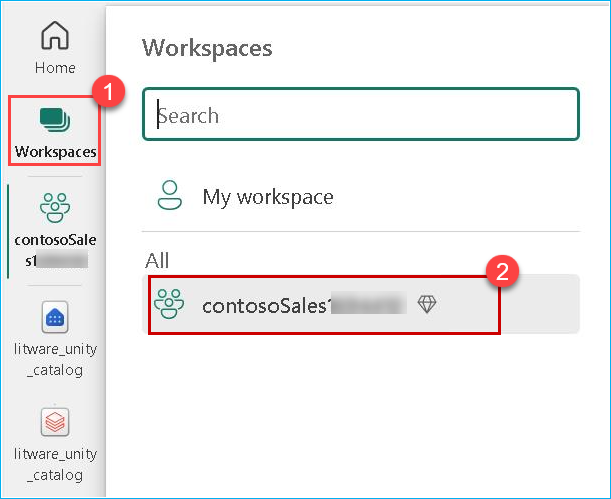

## Exercise 3: Building an AI-Powered Chatbot with Microsoft Fabric and Azure AI Studio

Contoso encountered a major issue with customer churn, especially among millennials. The executives at Contoso struggled to understand this customer segment and figure out how to earn their loyalty. Despite having extensive data from customer interactions, surveys, and market research, Contoso found it difficult to pinpoint the root cause of the churn and determine effective solutions. 

The main problem was the lack of integration in their existing systems. This prevented Contoso's executives from utilizing their data for root cause analysis and strategic insights, which in turn, hampered their ability to improve marketing strategies, product offerings, and customer experiences. 

To solve the data silos issue, Contoso implemented an advanced AI solution using Azure OpenAI, Azure AI Search, and Microsoft Fabric. Once the team discovered that millennials were leaving because they couldn't find products, they developed an Azure OpenAI-powered shopping assistant to help with product search and recommendations. 

In this exercise, we will learn how they achieved this! 

### Task 3.1: Integrate Fabric data with Azure AI Studio using Azure AI Search

Let's step into the shoes of Eva, the Data Engineer, as she launches Azure AI Studio and leverages data stored in Microsoft OneLake as knowledge base.

1. Navigate back to the Microsoft Fabric tab on your browser (https://app.fabric.microsoft.com).
 
2. Click on **Workspaces** and select **<inject key= "WorkspaceName" enableCopy="false"/>**.
 
   

3. Click **Manage access**.

   

4. Click **+ Add people or groups**.

   

5. Type **<inject key= "Search_service" enableCopy="true"/>**, select **Contributor** from the permission dropdown, and then click **Add**.

   

6. Click on **<inject key= "WorkspaceName" enableCopy="false"/>** from the left-hand side menu, then select **Lakehouse**.

   

7. Copy the **browser URL** as shown in the screenshot, and paste it into your notepad for later use.

   

8. Open the following Search service in the VM browser new window: **<inject key= "searchservice" enableCopy="true"/>** 

9. In the Search service, click on the **Import data** option to begin setting up the data source.

   

10. In the **Existing data source** dropdown, select the **OneLake files (preview)** option.

      

11. In the Connect to your data section, configure the following fields:

- **Data Source**: **OneLake files (preview)**.

- **Data source name**: **onelake**.

- **Data to extract**: **All metadata**.

- **Parsing mode**: **JSON array**.

- **Connect by**: **Lakehouse URL**.

- **Lakehouse URL**: Paste the Lakehouse URL you copied in the **Step 7**.

- **Lakehouse folder/shortcut**: **products**.

- **Managed identity authentication**: **System-assigned**.

12. Click on **Next: Add cognitive skills (Optional)** to proceed.

      

13. Click on **Skip to: Customize target index** to proceed.

      

14. Provide in the **Index name** field as **onelake-index**.

15. Provide in the **Key** field as **id**.

      

16. Ensure all fields have **Retrievable**, **Filterable**, **Sortable**, **Facetable**, and **Searchable** options checked as shown in the screenshot.


17. Once the field settings are configured, click on **Next: Create an indexer** to proceed.

      

18. Enter the name of the indexer as **onelake-indexer** and click on the **Submit** button.

      


---

### Task 3.2: Establish Azure OpenAI, Azure AI Content Safety, and AI Search Connections in Azure AI Studio

Contoso integrated all of their data sources using Microsoft Fabric, including customer feedback, sales records, social media interactions, and encompassing internal company policy documents such as SOPs and research articles on customer behavior into Azure AI Search. 
This created a unified, searchable knowledge base. 

Let's step into Data Engineer, Eva's shoes to see how.


1. In Azure portal Search for the **prj-build-<inject key= "DeploymentID" enableCopy="false"/>**, and select **prj-build-<inject key= "DeploymentID" enableCopy="false"/>** service from the results.

   
    
3. Click on the **Studio web URL**.

   

   >**Note:** Close any pop-up that appears on the screen throught the lab.

   

   >**Note:** Click on the **Expand** icon, if the left navigation is hidden.

   

2. Scroll down and click on the **Management center** from the bottom of the navigation menu.

   

3. Click **Connected resources** and select **New connection**.

   

4. Select **Azure OpenAI**.

   

5. You will find an Azure OpenAI resource with gpt-4o and text-embedding-ada-002 model deployment. Create a connection by clicking on the **Add connection** button.

   

6. Once the **OpenAI services are connected**, click on **Back to select an asset type**.

   

7. Click on **Azure AI Search**.

   

8. Click on **Add connection**.

   

9. Once the **AI Search is connected**, click on the **Close** button.

   

   > **Note:** If you're unable to see the Close option, try adjusting your screen resolution to 80% or 90%.

   

10. Notice that **Azure Open AI** and **Azure AI Search** connections are established successfully.

      

---

### Task 3.3: Setup and use Prompt Flow in Azure AI Studio

Prompt flow in Azure AI Studio offers a comprehensive, streamlined environment for creating AI applications. It provides a visual interface for orchestrating flows, and enables iterative prompt engineering. Azure AI Studio includes built-in evaluation tools, seamless deployment options, and integration with Azure's ecosystem. It also offers enterprise-level security and scalability, making it ideal for developing, testing, and deploying sophisticated AI solutions efficiently. Let's explore how Contoso deployed and tested a Prompt flow.

1. In the left navigation pane, click on **Go to Project** button.

   

2. Click on **Prompt flow** from the left navigation pane and then click on the **+ Create** button.

   

3. Scroll down and click on the **Upload** button in the Upload from local section.

   

4. Click on the **Zip file** radio button and then click on **Browse**.

   

5. Copy the path **C:\LabFiles\artifacts\artifacts\aistudio**, paste it in the **File name** textbox and then click on the **Open** button.

   

6. Click on **shopping-assistant-prompt-flow** and then click on the **Open** button.

   

7. In the Select flow type dropdown, select **Chat flow** and then click on the **Upload** button.

   

   >**Note:** If clicking on the Upload button doesn't redirect you to the Prompt Flow screen, click the Upload button again. If it still doesn't work, refresh the page and try uploading again.

8. Once the prompt flow is uploaded, you'll see a **graph** view with connected nodes representing each step in the flow.

   

9. Open a new tab, click on browser address bar, and copy paste the following web app link ``https://app-shopping-copilot-d1hz4ew.azurewebsites.net/`` and then press Enter.

    ```
    https://app-shopping-copilot-d1hz4ew.azurewebsites.net/
    ```
      

10. Click on the **terms and conditions checkbox** and then click on the **Login** button.

      
 
11. Click on the **Copilot icon** at the bottom right of the page.
 
      

12. Click on any of the **pre-populated questions**.
 
      
 
13. Observe the **response**.
  
      
 
With their new Shopping Copilot, Contoso was able to provide their customers with an online shopping experience that has an in-store feel. This simulates a personalized shopping experience that helps increase customers' engagement with enhanced data insights.
