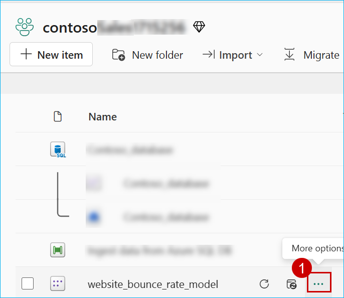
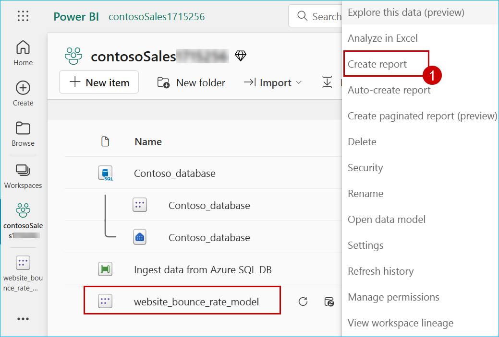
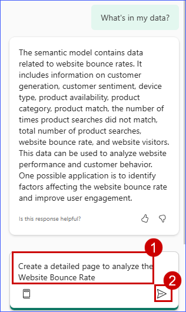

### Exercise 4: Power BI Experience in Fabric (Optional)
 With the wide spectrum of data sources and Litware's data in OneLake, it is now time to get some awesome insights and visualizations from this data. Let's dive deep into the experience of the Business Analyst, Wendy, and do just that.

### Task 4.1: Create a Semantic model and generate insights using Copilot for Power BI

Based on all the gathered data, Wendy is expected to create Power BI reports for other data citizens and stakeholders. Let's step into her shoes to experience the power of Copilot for Power BI in conjunction with Direct Lake Mode.


1. Navigate back to the Microsoft Fabric tab on your browser.

2. Click on **Workspaces** and select **<inject key= "WorkspaceName" enableCopy="false"/>**.

    

4. Click on the **lakehouse**.

    

5. Click on the **New semantic model** button. 

    

6. In the **Name** field, enter **website_bounce_rate_model**.

    ```
    website_bounce_rate_model
    ```

7. Search for **website_bounce_rate**, scroll down and select **website_bounce_rate** table, then click on the **Confirm** button.

    

    >**Note**: Wait for the **semantic model** creation.

8. Select **Settings** and **Power BI settings** from the 'Resources and extensions' section.

    

    >**Note:** If the settings icon is not visible, click on the three dots next to Profile icon and select Settings.

    

9. Click on the **Semantic models** tab and select **website_bounce_rate_model** semantic model from the left pane.

    

10. Scroll down to **Q&A** section and expand it, then select **Turn on Q&A to ask natural language questions about your data** checkbox, and click on **Apply**.

    

    >**Note :** If Turn on Q&A to ask natural language questions about your data checkbox is enabled already,continue with the next step.

11. Navigate back to workspace and Select the ellipsis (three dots) next to the **website_bounce_rate semantic** model.

    

12. To create a new report using this semantic model, click on **Create report**.
 
    

14. Click the **Try Free** button in the pop-up window.

    

15. In the confirmation dialog, click the **Got it** button to continue.

13. Click on the **Copilot** icon and collapse the other panes named Filters, **Visualizations** and **Data**.

    

    >**Note:** Close any pop-up that appears on the screen.

    

14. Click on **Get started**.

    


You will now see how easy it is for the data analyst to create compelling Power BI reports and get deep insights with literally no hands-on coding!
	
17. Click on the **Prompt Guide** button.

      

18. Select the option **What's in my data?**

    > **Note:** If you don't see the 'What's in my data?' option, click in the **Copilot chat box** field, enter the prompt below, and click the **Send** button: 

    ```
    What's in my data?
    ```
    

The first option, 'What's in my data?' provides an overview of the contents of the dataset, identifies and describes what's in it and what the attributes are about. So, there's no need to wait for someone to explain the dataset. This improves the efficiency and volume of report creation.


19. Click on the Copilot chat box field and enter the prompt below.

    ```
    Create a detailed page to analyze the Website Bounce Rate
    ``` 

    >**Note:** Wait for the prompt to populate.

20. Click on the **Send** button and wait for the results to load. 

    
	
    >**Note:** If you see the error message saying, 'Something went wrong.', try refreshing the page and restart the task. Being in a shared environment, the service may be busy at times.
    >- If Copilot needs additional context to understand your query, consider rephrasing the prompt to include more details.

    >**Note:** The responses from Copilot may not match the ones in the screenshot but will provide a similar response.

    

Based on this report, we notice that the website bounce rate for Contoso is especially high amongst the Millennial customer segment. Let's ask Copilot if it has any recommendations for improving this bounce rate based on the results and data in the report.

We'll ask Copilot for suggestions based on the results and data in the report. 

21. Enter the following prompt in Copilot, and press the **Send** button.

    ```
    Based on the data in the page, what can be done to improve the bounce rate of millennials?
    ``` 
	
  
	
22. Look at the suggestions Copilot provided. Copilot creates the desired Power BI report and even goes a step further to give powerful insights. Wendy realizes that for the website bounce rate to improve, Contoso needs to transform their mobile website experience for millennials. This helps them reduce their millennial related customer churn too! Now, what if Contoso's leadership team needed a quick summary of this entire report? **Smart Narrative** to the rescue! 
	
    

23. It is also possible to apply some formatting using Copilot. Enter the following prompt in Copilot, and press the **Send** button.

    >**Note:** If the chart you are trying to replace does not exist in the report was generated by Copilot try replacing another visual.

    ```
    Replace Bounce Rate by Customer Generation chart with a Bar Chart.
    ```

    

24. Notice that now the top right column chart has been replaced with a bar chart.

    
	
25. Expand the **Visualizations** pane and select the **Narratives** visual. 

    

26. Adjust and expand the **narrative box** from the corner to get a better readable view of the result.
 
    
 
27. Click on the **Copilot (preview)** button within the visual.
 
    
   
28. Click on **Give an executive summary**.
 
    >**Note:** If you see the prompt populated in the Copilot text box move to the next step otherwise, click on the **Copilot narrative** text box, enter the given prompt, and then click on **Update**
    
    ```
    Summarize the data, provide an executive summary, indicating important takeaways.
    ``` 

    
 
29. Click on the **Close** button in the pop-up window.
 
    
 
See how easy it was to get an executive summary with absolutely no IT resource dependency!
	
The summary could also be generated in another language, if specified. Additionally, the summary updates if you filter the report on any visual.
