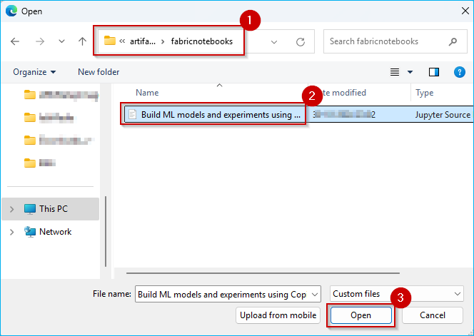
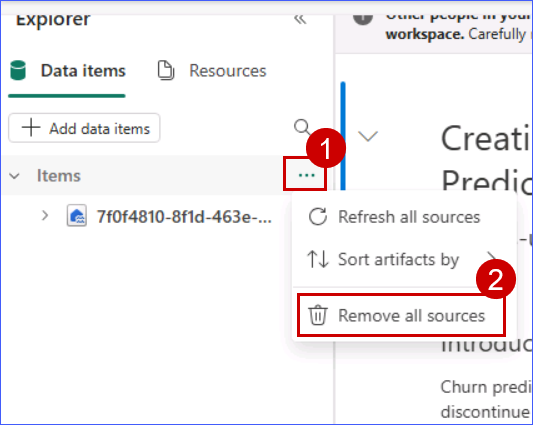
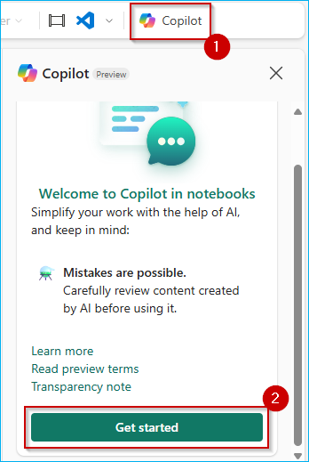

### Exercise 5: Explorer Data Science experience in Microsoft Fabric (Optional)
 
Microsoft Fabric offers Data Science experiences to empower users to complete end-to-end data science workflows for data enrichment and business insights. You can complete a wide range of activities across the entire data science process, all the way from data exploration, preparation and cleansing to experimentation, modeling, model scoring and serving predictive insights to BI reports.

### Task 5.1: Build ML models and experiments using Copilot in Fabric

   

To understand the cause behind Contoso's declining revenue, the team needed to dive deeper into their customers' spending pattern.

Copilot responds to queries in natural language or generates customized code snippets for tasks like creating charts, filtering data, applying transformations, and building machine learning models.

Let's see how Copilot for Notebook helps you, as a Data Scientist, quickly create Data Science Notebooks.

1. From the left navigation pane, click on the **<inject key="WorkspaceName" enableCopy="false"/>** workspace. Then, click the **Import** dropdown and select **Notebook**. Choose From this computer, and on the Import Status page, click **Upload** to upload the notebook.

    

2. Browse to the fabricnotebooks folder in your VM  by following the path ```C:\LabFiles\artifacts\artifacts\fabricnotebooks```, and then select **Build ML models and experiments using Copilot for Data Science in Fabric** notebook.

3. Click on the **Open** button.

    

4. Wait for the notebook to **upload**.

    

5. Click on the **<inject key= "WorkspaceName" enableCopy="false"/>** workspace from the left navigation pane.

    

6. Click on **Filter**, expand **Type** and select **Notebook**.

    

7. Click on the **Build ML models and experiments using Copilot for Data Science in Fabric** notebook.

    

8. Click on the **three dots (⋯)** next to **Items** under Data items.

9. Select **Remove all sources** from the dropdown menu.

    >**Note**: If the **Remove all sources** option is not enabled, proceed to Step 11 and set the newly added **Lakehouse** data source as the default.

    

10. Click on the **Continue** button.

    

11. Click on **Add data items** and select **Existing data sources** from the dropdown menu.

    

12. Select the **lakehouse** checkbox and click on the **Connect** button.

    

13. Click on the **Connect** dropdown button in the toolbar and select **New standard session** to initiate a Spark compute session.

    

14. Click on the **three dots (ellipsis)** from the ribbon, then click on the **Copilot** button. In the Copilot pane, click on the **Get Started** button.

    

15. Copy and paste the **below prompt** in the textbox.

    ```
    Please load "customerchurndata" table from the Lakehouse into a Spark DataFrame. Then convert that into pandas dataframe as df.
    ```

16. Click on the **send** button.

    

17. Click on the **Copy code** icon.

    

18. Hover above the first cell and then click on the **+ Code** icon.

    >**Note:** The new cell will be created right above the existing cell.

    

19. Paste the **copied query** and run the new **cell**.

    

    >**Note:** Copilot may not respond as expected, please copy and paste the following code  if the code execution fails:

    ```
    park_df = spark.table('lakehouse.customerchurndata')

    Convert the Spark DataFrame to a pandas DataFrame df = spark_df.toPandas()
    ```

With the data prepared with the help of Copilot, Data Scientists like you can explore the data to understand the patterns it contains.

The rest of the notebook has similar PySpark queries to explore customer churn prediction.

---


Congratulations! You, as Data Engineers and Data Analysts have helped Contoso gain actionable insights from its disparate data sources, thereby contributing to future growth, customer satisfaction, and a competitive advantage.

In this lab we experienced the creation of a simple integrated, open and governed Data Lakehouse foundation using Modern Analytics with Microsoft Fabric and Azure Databricks.

In this lab we covered the following:

First, we explored the Data Engineering/Data Factory experience and learned how to create a Microsoft Fabric enabled workspace, build a Lakehouse, and ingest data into OneLake using Microsoft Fabric, including Delta tables, dataflows, and pipelines for both low-code and no-code data transformations.

Second, we explored the integration of Azure Databricks with Microsoft Fabric, including using Delta Live Tables for transformations, Unity Catalog for data governance, and analyzing mirrored Databricks data using T-SQL.

Third, we created a semantic model in Power BI and generate insights using Copilot in Microsoft Fabric.

Fourth, we explored real-time data ingestion using Eventstream and analyzed patterns, anomalies, and outliers with Copilot in KQL Database.

Finally, we explored Streaming data using KQL DB for a Real-time Analytics experience. Here, we created a KQL Database, ingested real-time and historical data into KQL DB, analyzed patterns to uncover anomalies and outliers with the help of Copilot, and leveraged AI for data Q&A.

