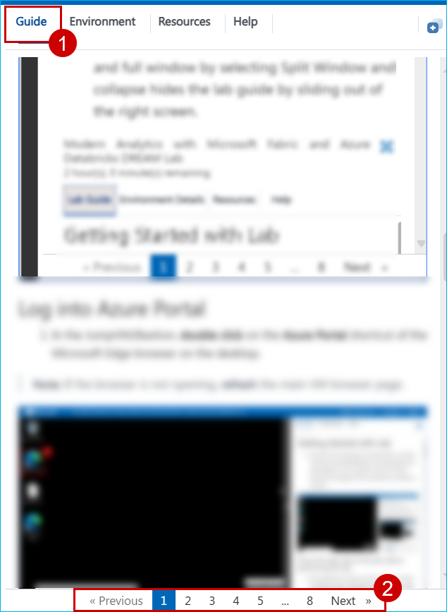
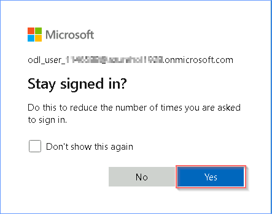

# Getting Started with Lab

1. Once the **Environment** is provisioned, a virtual Machine (JumpVM/Bastion) and **Guide** gets loaded in your browser. Use this virtual Machine throughout the workshop to perform the lab. 

   

### Familiarize yourself with the Lab Environment, before you begin!

1. The **Guide** tab contains all the steps required to complete the lab. You can use the numbers at the bottom of the **Guide** to navigate between different **Exercises**.

   

2. Before starting the Lab, take a moment to explore the following tabs:

    - **Guide**
    - **Environment**
    - **Resources**
    - **Help**

   

3. You can view the **Guide** in a separate full window by selecting **Split Window**, or hide the **Guide** by **collapsing it**, which slides it out of the right side of the screen.

   

# Log into Azure Portal

1. In the JumpVM/Bastion, **double click** on the **Azure Portal** shortcut of the Microsoft Edge browser on the desktop.

    >**Note:** If the browser is not opening, **refresh** the main VM browser page.

   

2. If you see the pop-up notification to restore pages, click on  **"x"**  to close it.

    

3. On the **Microsoft Azure** browser tab, paste the provided **Username**: **<inject key= "AzureAdUserEmail" enableCopy="true"/>**  to **Sign in** and click **Next**.

   

4. Now paste the following **Password**: **<inject key= "AzureAdUserPassword" enableCopy="true"/>** and click on **Sign in**.

   

5. Click on **Yes** button.

   

6. Click **No, Thanks** button on the pop-up prompting to **Sign in to Microsoft Edge**.

   
   
    >**Note:** After logging into the Azure Portal, if a pop-up page titled **"Welcome to Microsoft Azure"** appears, click **Cancel** to skip the tour.

   

# Support Contact

The CloudLabs support team is available 24/7, 365 days a year, via email and live chat to ensure seamless assistance at any time. We offer dedicated support channels tailored specifically for both learners and instructors, ensuring that all your needs are promptly and efficiently addressed.

Learner Support Contacts:

- Email Support: cloudlabs-support@spektrasystems.com
- Live Chat Support: https://cloudlabs.ai/labs-support

Now, click on Next from the lower right corner to move on to the next page.

